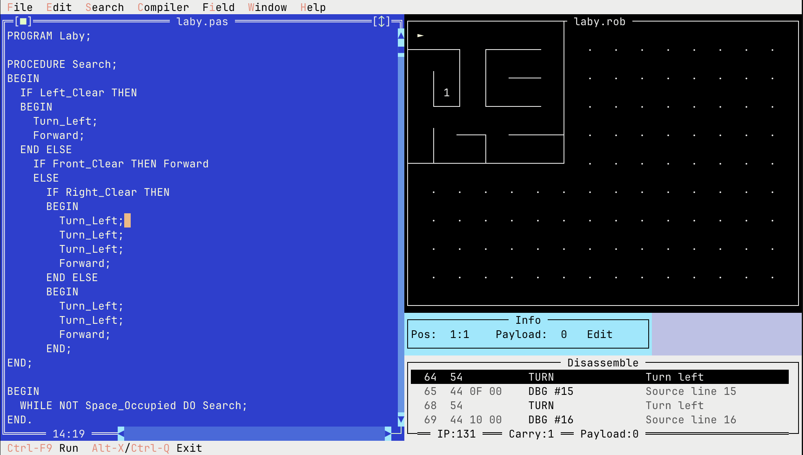

# tvNiki

[](https://github.com/sttts/tvniki-2026/actions/workflows/build.yml)

An educational programming environment where students control a robot named "Niki" through a Pascal-like language. Originally created in 1996 for DOS, now ported to Free Pascal with UTF-8 support.



## Overview

tvNiki teaches programming fundamentals through a simple robot simulation. Niki moves on a grid, collects and places objects, and navigates around walls. Students write programs using basic control structures (IF/THEN/ELSE, WHILE/DO, REPEAT/UNTIL) and procedures.

## Installation

### macOS (Homebrew)

```bash
brew install --head sttts/tvniki-2026/tvniki
```

### Linux (Pre-built Binaries)

Download from [GitHub Releases](https://github.com/sttts/tvniki-2026/releases):

- `tvniki-linux-x86_64` - Linux x86_64
- `tvniki-linux-arm64` - Linux ARM64

```bash
chmod +x tvniki-linux-*
./tvniki-linux-x86_64
```

### Building from Source

```bash
# macOS
brew install fpc

# Debian/Ubuntu
sudo apt-get install fpc

# Clone and build
git clone --recursive https://github.com/sttts/tvniki-2026.git
cd tvniki-2026
make
```

## Running

```bash
./niki              # Start with empty editor
./niki program.pas  # Load a program file
```

## Robot Commands

| Command | Description |
|---------|-------------|
| `Vor` | Move forward one cell |
| `Drehe_Links` | Turn left 90 degrees |
| `Nimm_Auf` | Pick up object from current cell |
| `Gib_Ab` | Place object on current cell |

## Sensor Functions

| Function | Returns true when... |
|----------|---------------------|
| `Vorne_Frei` | Cell ahead is free |
| `Links_Frei` | Cell to the left is free |
| `Rechts_Frei` | Cell to the right is free |
| `Platz_Belegt` | Current cell has an object |
| `Hat_Vorrat` | Robot is carrying objects |

## Example Program

```pascal
PROGRAM Laby;

PROCEDURE Suche;
BEGIN
  IF Links_Frei THEN
  BEGIN
    Drehe_Links;
    Vor;
  END ELSE
    IF Vorne_Frei THEN Vor
    ELSE
      IF Rechts_Frei THEN
      BEGIN
        Drehe_Links;
        Drehe_Links;
        Drehe_Links;
        Vor;
      END ELSE
      BEGIN
        Drehe_Links;
        Drehe_Links;
        Vor;
      END;
END;

BEGIN
  WHILE NOT Platz_Belegt DO Suche;
END.
```

## File Types

- `.PAS` - Program source code
- `.NIK` - Compiled bytecode
- `.ROB` - Field/world files (grid layout)

## Keyboard Shortcuts

- `Ctrl-F9` - Compile and run
- `Alt-F9` - Compile only
- `Ctrl-F8` - Single step (debug mode)
- `Ctrl-F2` - Reset/stop program
- `Alt-X` / `Ctrl-Q` - Exit

## Disassemble Window

The disassemble window (Compiler → Disassemble) shows the compiled bytecode with human-readable descriptions:

```
-->   7  DBG #5      Source line 5
     10  CLF         Check left free
     11  JNC 18      Jump if false to 18
     14  TURN        Turn left
     15  GO          Go forward
```

Features:
- Auto-updates after compilation
- Current execution line highlighted in blue with `-->` marker
- Shows instruction pointer (IP) and carry flag in the status bar
- Follows execution during run and single-step debugging
